**Щеглова Ольга (Борис Бидяга)** 

# ВСТАЮЧА З КОЛIН 

### Сатирична міні-п’єса 
### до 72-ї річниці народження Путіна  

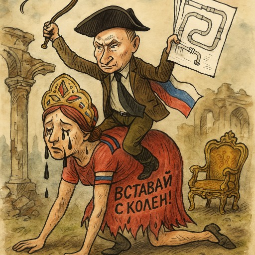

### ДІЙОВІ ОСОБИ: 
– Росія 
– Путін, який називає себе президентом Росії

> Росія стоїть на колінах, задумливо дивлячись у простір. Входить Путин, у військовій формі, на ногах чоботи з шпорами.

**Путін** (гримлячи):  
– Ти знову на колінах? Якого біса? Я ж підняв тебе з колін!  

**Росія**:  
– Ой, милєночок пожалів! А я вже й не сподівалась… Зачекалась зовсім… Ну розповідай: де пропадав? Що робив?  

**Путін** (по-ведмежий буркливо):  
– На війну ходив.  

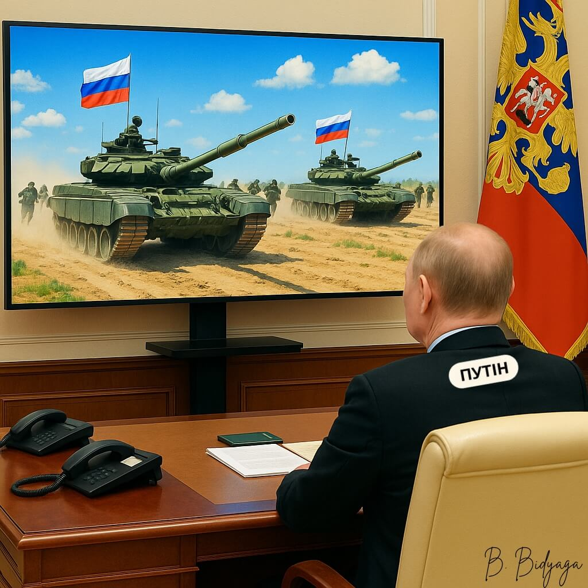

**Росія** (з щирим інтересом):  
– На війну? А з чого це ти війну заварив? З кимсь посварився? Чи хто тебе скривдив?  

**Путін** (з ненавистю):  
– Та дурість ота зарозуміла, сусідка твоя…  

**Росія** (жваво):  
– Ця, що зліва? Чи справа?  

**Путін** (похмуро):  
– Зліва. Уявила себе, розумієш, самобутньою нацією… Та яка ти нація? Шльондра жовто-блакитна… Побічний продукт історії. Ось ти хто.  

**Росія** (згодливо киваючи):  
– Ах вона безсоромниця!  

**Путін** (з презирством):  
– Та ще й у президенти собі кого взяла!  

**Росія** (наївно):  
– Кого?  

**Путін** (злісно):  
– Та клоуна цього, прости Господи, та ще й жида! Йому б лише на сцені паяцити, а він кривляється з трибун, у НАТО лізти хоче!  

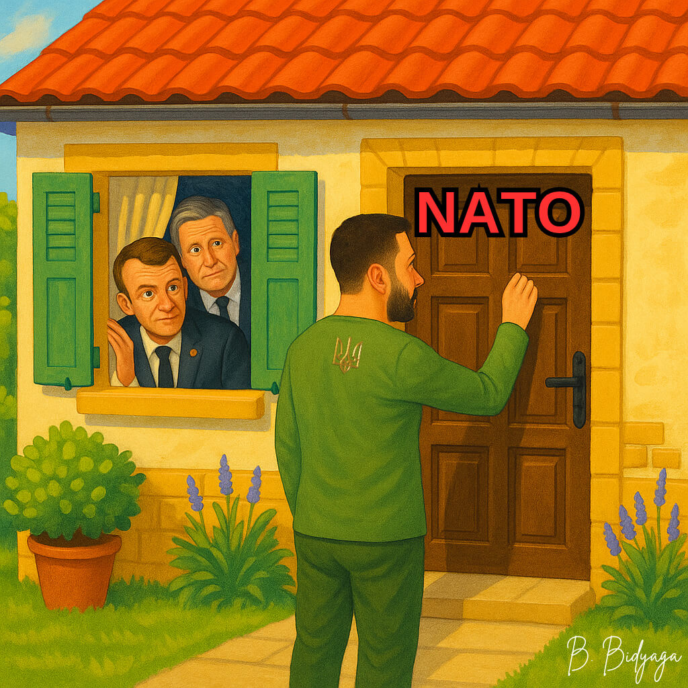

**Росія** (зневажливо):  
– Та куди йому в НАТО — зі свинячим рилом у калашний ряд…  

**Путін** (запально):  
– Ось воно що! Свині місце у свинарнику. Сиділа б собі, бурду жерла та хрюкала. Але ні — вона хрюкає на дурних самітах, права свої свинячі вимахує! А про мої права ніхто й слухати не хоче! 

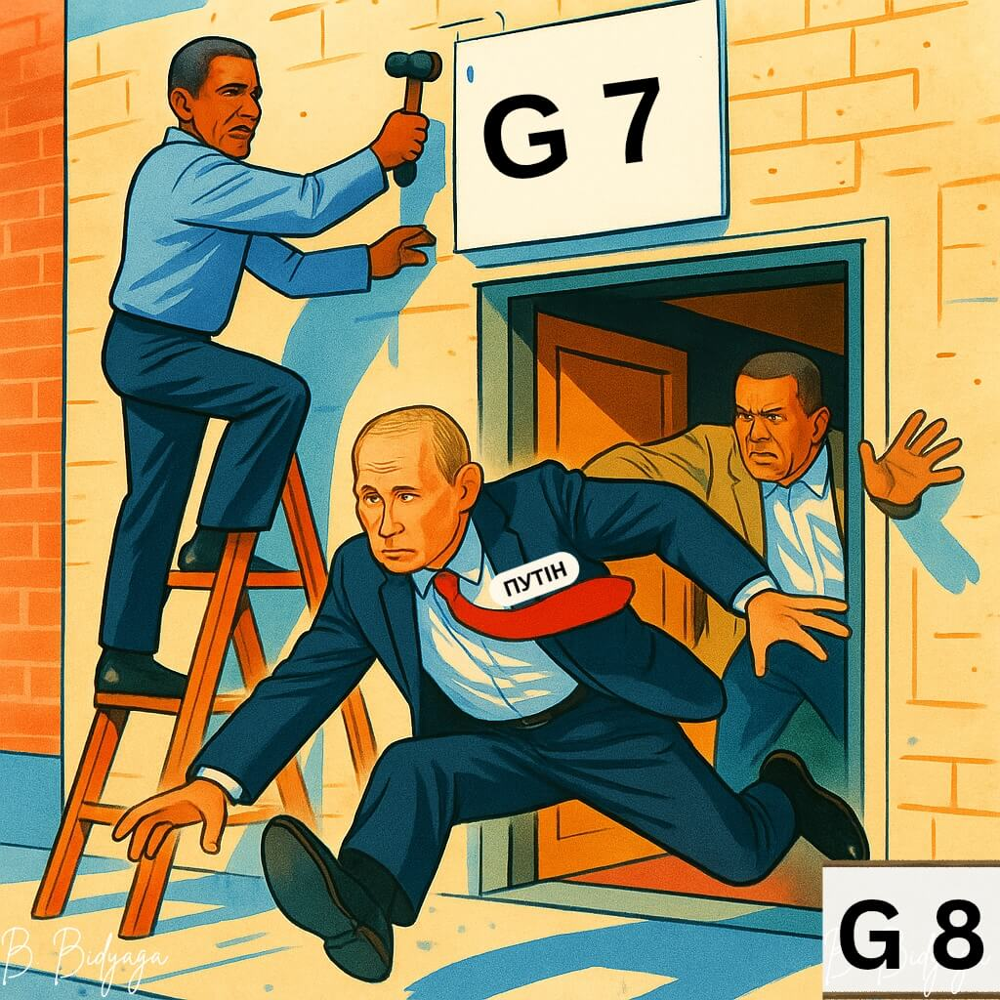

**Путін**  (продовжує):
— А ця свиня мої землі захапала! Захапала та жирує, трильйони зирить! Землі ж, між іншим, ісконно-русскіє… Тут Русь Свята стояла, князь Володимир Красне Сонечко на троні сидів, на печенігів та половців ходив…  

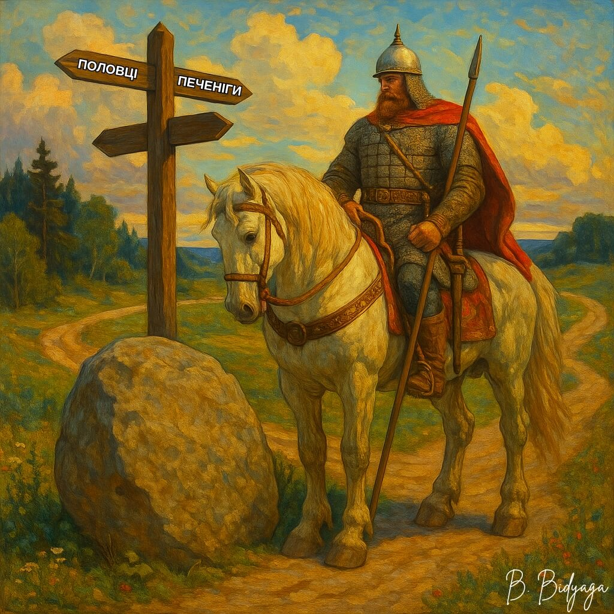

**Росія** (підлесливо):  
– Та в тебе ж, мабуть, і своєї землі вистачає?  

**Путін** (стогнучи):  
– Та яка це земля? Болота та пустирі, тундра з тайгою — що на них виросте? А в неї — чорнозем, земля жирна… Житниця, розумієш, усьому світу годувальниця…  

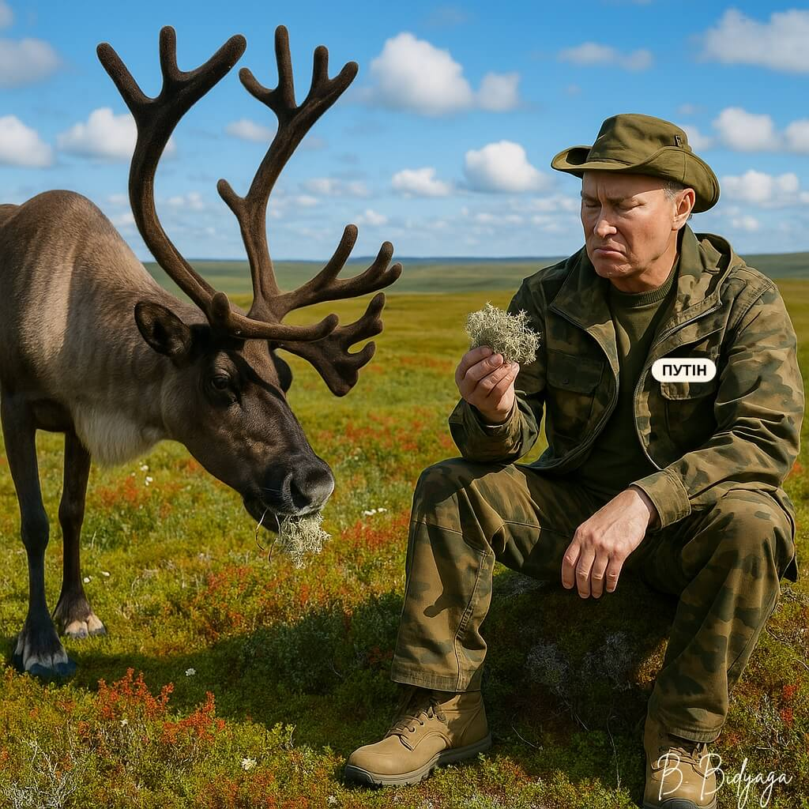

**Росія** (докірливо):  
– Ах вона безсовісна!  

**Путін** (меланхолійно):  
– А заводи, шахти, електростанції... Усе це ми, русскіє, ось цими руками збудували, розумієш?  

(Путін  піднімає долоні до обличчя й уважно їх розглядає.)

**Путін** (продовжує):  
– А вона це все захапала та й користується. За яким правом?  

**Росія**:  
– А чого це руки в тебе якісь... червоні?  

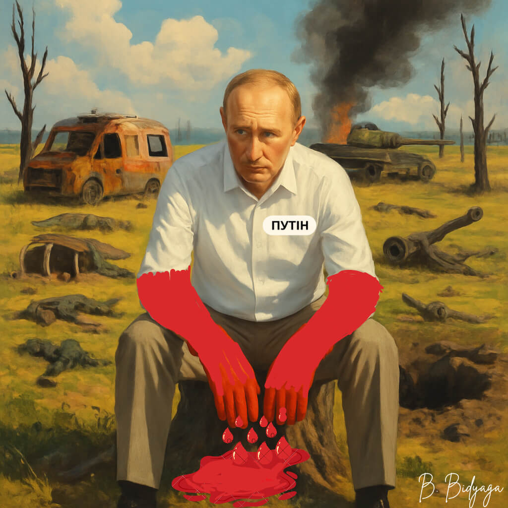

**Путін** (з дратівливістю):  
– Тобі глючить. Руки як руки. Сходи до лікаря — перевір зір.  

(Пауза)

**Путін**  (продовжує):
– Так от, що я хотів сказати... Адже ця зараза... наших людей кривдить: не дає їм по-русскій розмовляти. Уявляєш?  

**Росія** (люто):  
– Та їй всі волосиня повиривати треба, ота нахабка! Ну ти ж їй показав, де раки зимують?  

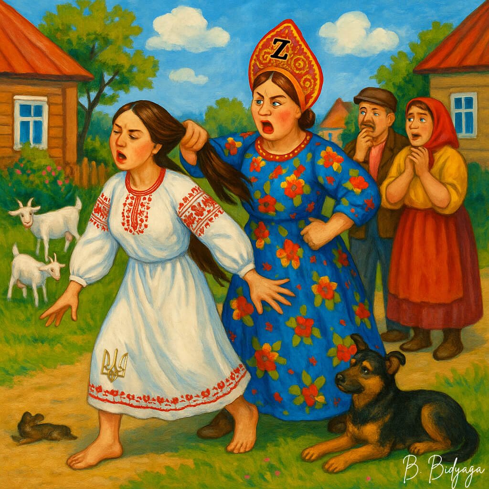

**Путін** (пригнічено):  
– Та я б їй показав, я б їй кишки на шию намотав... Та ж вона баба прожжена — під піндо́сів лягла...  

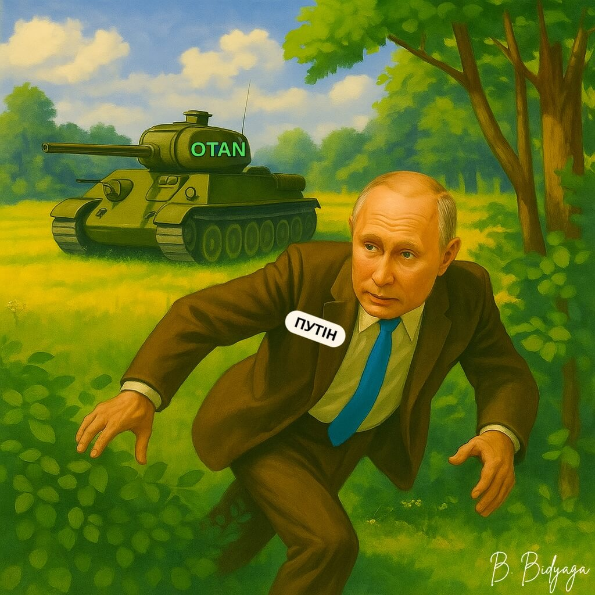

**Росія** (в екстазі):  
– Ах вона розпусниця!  

**Путін** (нетерпляче):  
– Так я ж і кажу: шльондра, клейма ставити нема куди. Натовська підстилка. У них, розумієш, зброю клянчить.  

**Росія** (з недовірою):  
– І що — дають?  

**Путін** (не приховуючи люті):  
– Ще й як дають! Танки, снаряди, ракети... 

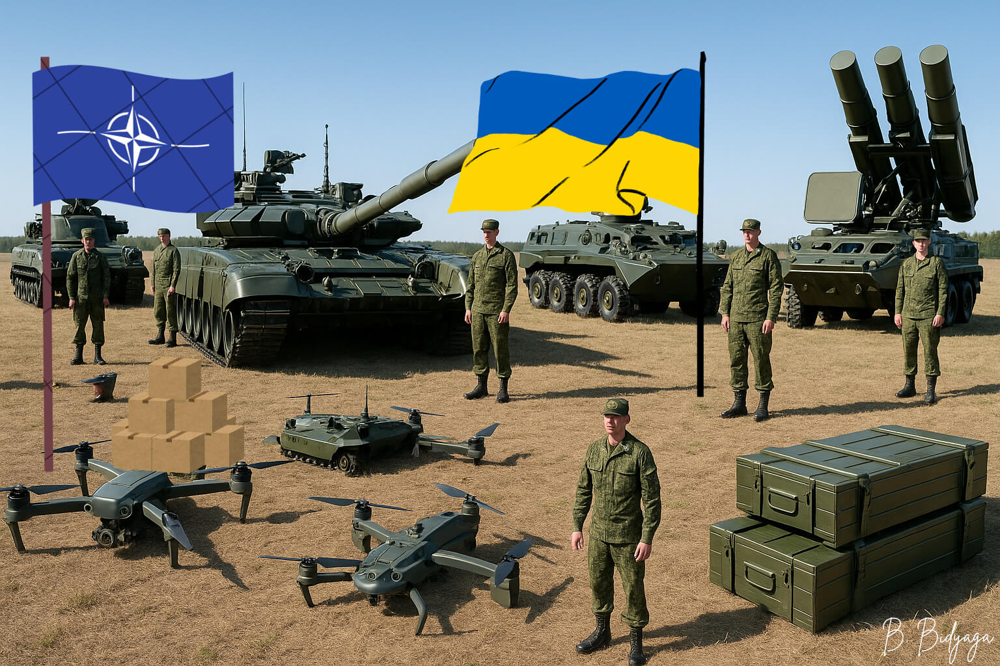

**Путін**  (продовжує):
— Такі ракети, що навіть у мене таких немає, розумієш? З одного пострілу — прямо в яблучко. Порозносили мені всі нафтосховища й НПЗ — мені ж техніку заправляти нічим. Хоч на конях снаряди підвози.  

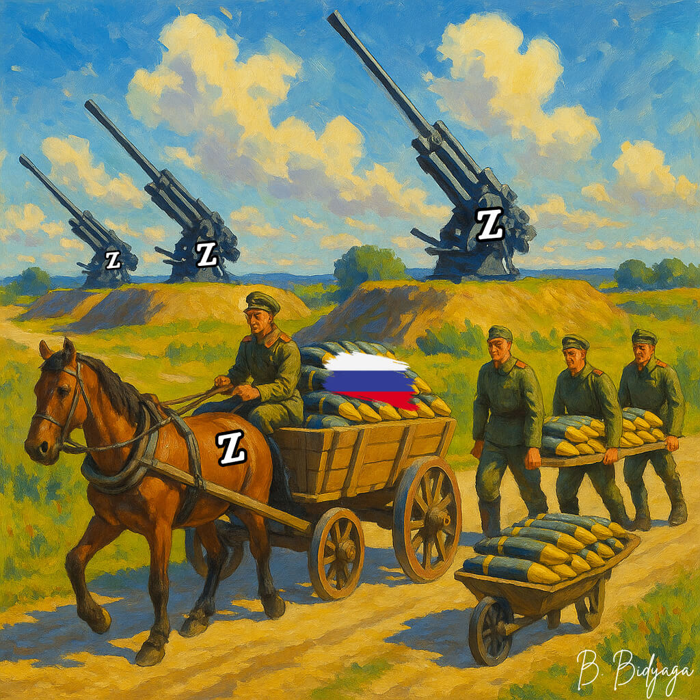

**Росія** (сплеснувши руками):  
– Ах, Боже мій! Та як вони сміють!  

**Путін** (трагічним голосом):  
– Під Ростовом так влупили — півсховища, як порох, зайнялося. За п’ять днів згоріло на півмільярда рублів. Досі загасити не можуть.  

**Росія** (засмучено):  
– Оце лихо! А поприскати святою водицею не пробували? З вертольота?  

**Путін** (важко зітхаючи):  
– Та вже й молебень відслужили, і мощі підносили, і попи з іконами хоровод водили…  

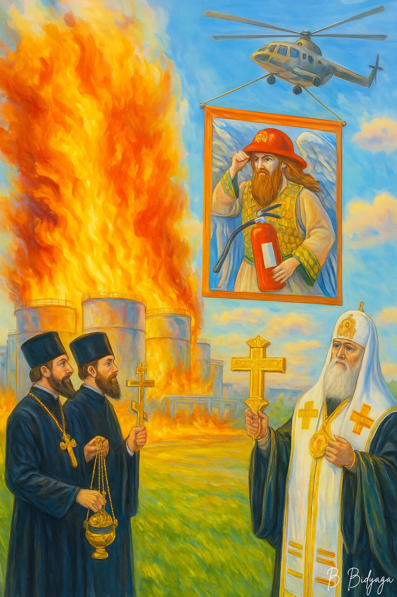

**Росія** (стурбовано):  
– І не допомогло? Оце ж нечиста сила! А з кадилом навколо не обходили?  

**Путін** (завзято):  
– І з кадилом обходили. Тричі обходили.  

**Росія** (повчально):  
– А як ходили? Обходити треба по сонячному колу.  

**Путін** (метушливо):  
– Так і зробили, так і зробили. По сонячному колу. За годинниковою стрілкою.  

**Росія** (здивовано):  
– І не допомогло?  

**Путін** (сумно, хитаючи головою):  
– Ані хріна не допомогло.  

**Росія** (після короткої паузи раптом хапається за голову й починає голосити):  
– Батюшки-світи! Святі угодники! Зглазили тебе, милєночок! Ой, зглазили! Супостати окаянні, нехристи чужеземні! Ой-ой-ой! Що ж робити? Не інакше як до баби треба йти!  

**Путін** (роздратовано):  
– До якої ще баби? Що ти несеш?!  

**Росія** (продовжує голосити):  
– Заговор на воду наговорити… «Спаси раба Божого Володимира від Змія летючого, від Змія повзучого, від нещасного випадку… Ворог, сатана, лихий чоловік, відчепись від нього, як звір від звіра, змій від змія, єретик від єретиці, чаклун від чаклунки…» Тьфу, тьфу, тьфу! [Тричі плює через ліве плече й хреститься.]

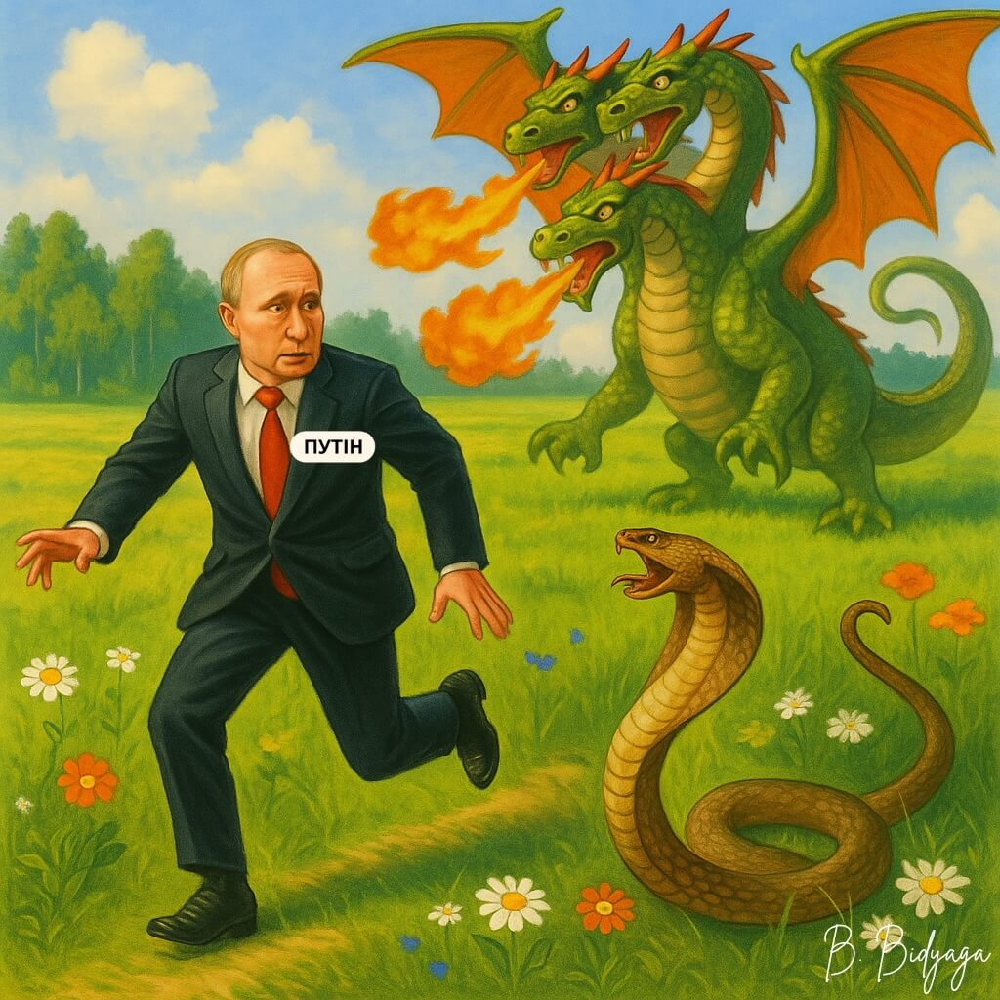

**Росія** (продовжує):  
– Воду так-то заговорити; тричі тією водицею через поріг умиєшся — і все в тебе налагодиться, от тобі хрест! Тільки диви — умиватися треба на зорі, ледве світати почне.  

**Путін** (приголомшений цією палкою промовою, підлабузницьки):  
– Думаєш, допоможе?  

**Росія** (із запалом):  
– Та як же! І на базу твою нафтову теж порчу навели. Тією ж водичкою заговореною на вогонь побризкаєш — тільки зоря на сході займеться — і враз той пожежа згасне.  

**Путін** (задумливо):  
– І де мені ту бабу знайти?  

**Росія** (охоче):  
– Та в будь-якій церкві знайдеш таку знахарку-чаклунку. Походь, поспитай; чай, добрих людей на світі багато — небіж допоможуть, як не допомогти.  

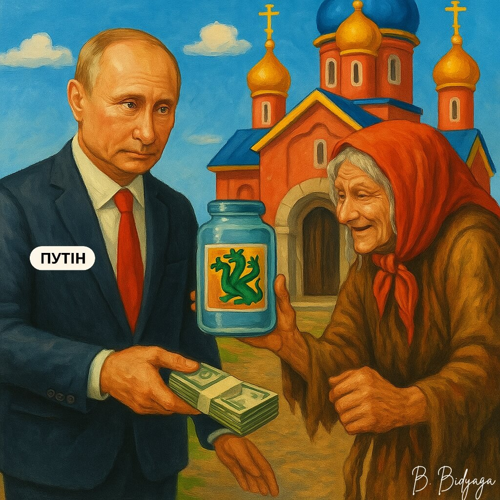

**Росія** (після паузи, таємничо):  
– І ще ось що… Остерігайся чорних котів. Не ровен час — ця нечисть тобі дорогу перебіжить…  

**Путін** (самовдоволено):  
– Та я цих чорних котів одним поглядом… Ось на днях одна хотіла мені шлях перетнути — так я на неї так глянув — одразу хвіст піджала та в кущі.  

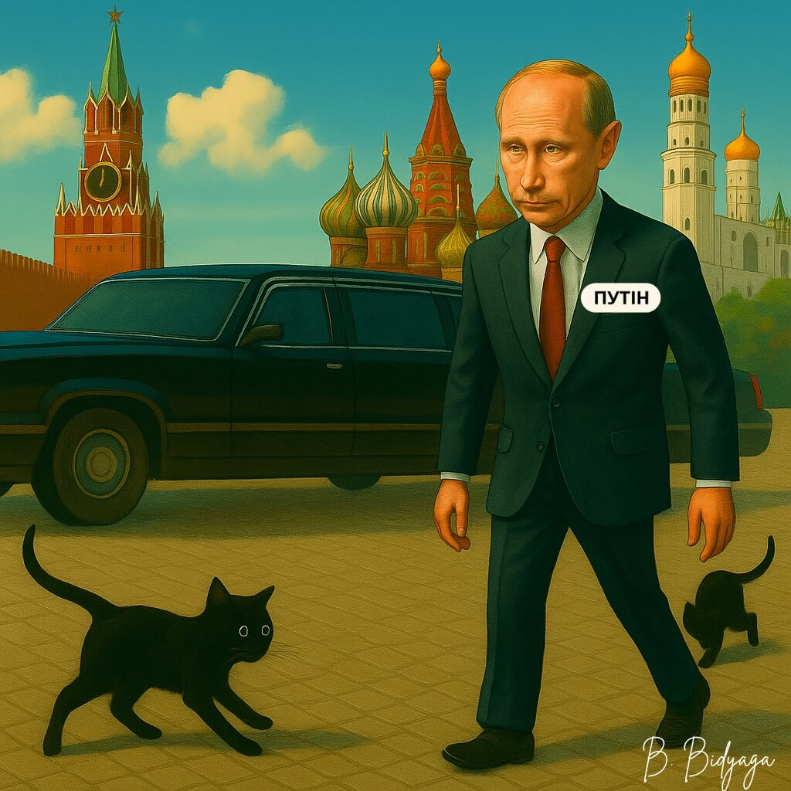

**Росія** (схвально):  
– Ай красень! Ай молодець!  

(Коротка пауза.)

**Росія** (раптом, збуджено):
– А супостату отому приворотне зілля треба піднести. Щоб мир та любов…  

**Путін** (перебиває з диявольською посмішкою):  
– Ми вже його частували «приворотним зіллям»... З нашої секретної лабораторії...  Не спрацювало.

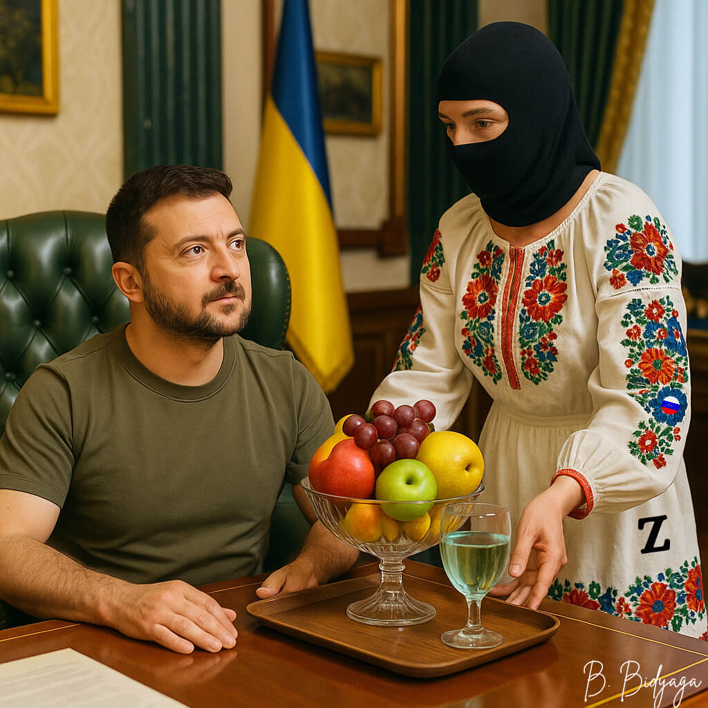

**Росія** (задумливо):  
– А то ж — закопати в мурашник жабу, і буде тобі через два тижні лопаточка та гачок. Той гачок на куртку йому непомітно причепити — і зачахне, як пити дати!  

**Путін** (зверхньо):  
– Та на кой біс мені твої жаби? Я й без жодних гачків його вбити можу. Двадцять перше століття на дворі, як-не-як, щоб його чорт узяв!  

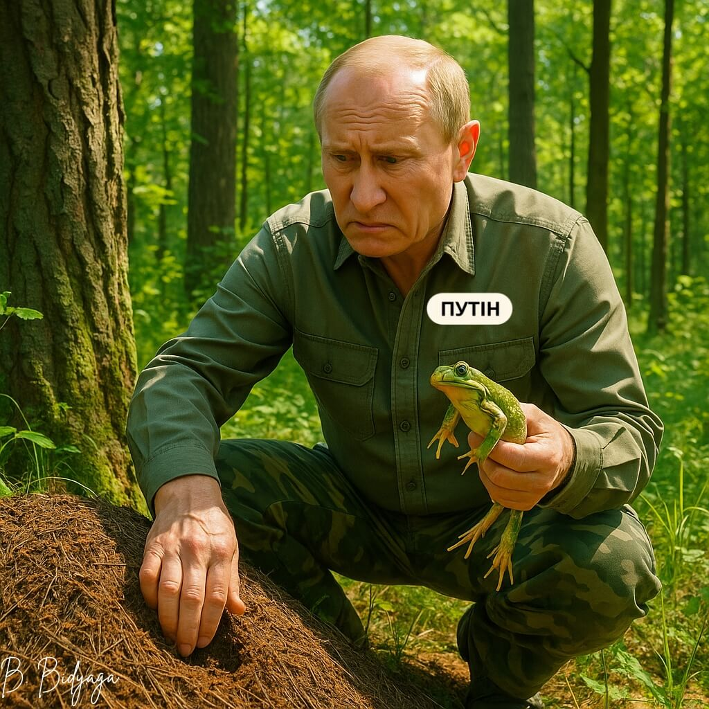

**Росія** (здивовано):  
– Ну?  

**Путін** (похмуро):  
– Яке «ну»? Баранки гну. Боюся, що мстити почнуть. Палиця — вона з двох кінців…  

(Пауза)

**Путін** (з гіркотою):  
– У них тепер літаки!.. Американські!.. F-16! Чула? Це ж не літак, а вогняний дракон! Думаєш, він тільки бомби кидати вміє? Хріна з два! Він ще й винищувач, він ще й перехоплювач! Три в одному, твою матер за ногу! Сука! Сука! Сука! 

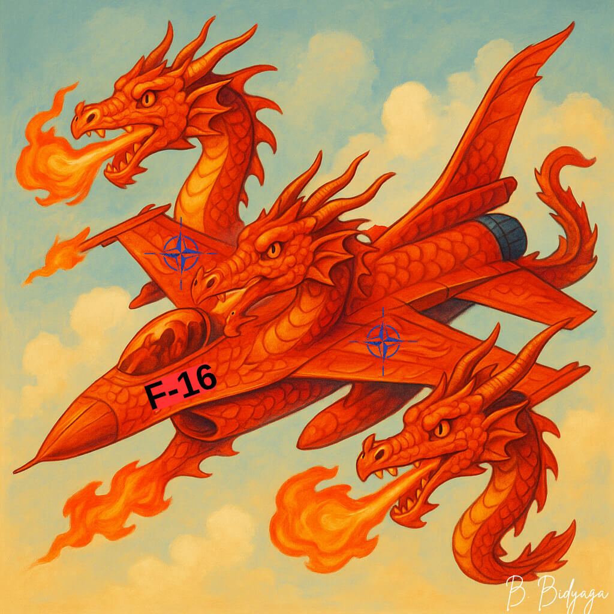

**Росія** (з огидою):  
– От чого вигадали, чорти окаянні!  

**Путін** (зриваючись на крик):  
– У нього ж радар з фазованою решіткою! Ти уявляєш? Він же всі цілі бачить за триста п’ятдесят кілометрів! 

**Росія** (спантеличено):  
– Хто?  

**Путін** (з надривом):  
– Та пілот! Пілот, який у літаку сидить!  

**Росія** (з огидою):  
– Ах він паразит!  

**Путін** (май не ридаючи):  
– І в туман, і в непогоду — все бачить!  

**Росія** (дурнувато моргаючи):  
– Та що ти кажеш?  

**Путін** (в істериці):  
– Він же мене в Кремлі бачить!!!  

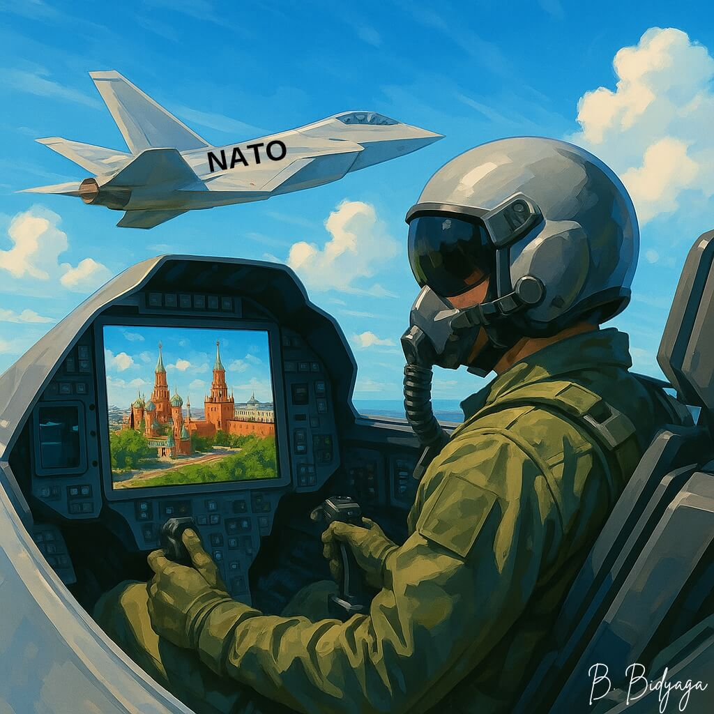

**Росія** (сумніваючись):  
– Ну, до Кремля ж, мабуть, відстань побільша буде, ніж триста п’ятдесят кілометрів?  

**Путін** (обурено):  
– Та вони ж порушують наш кордон! 

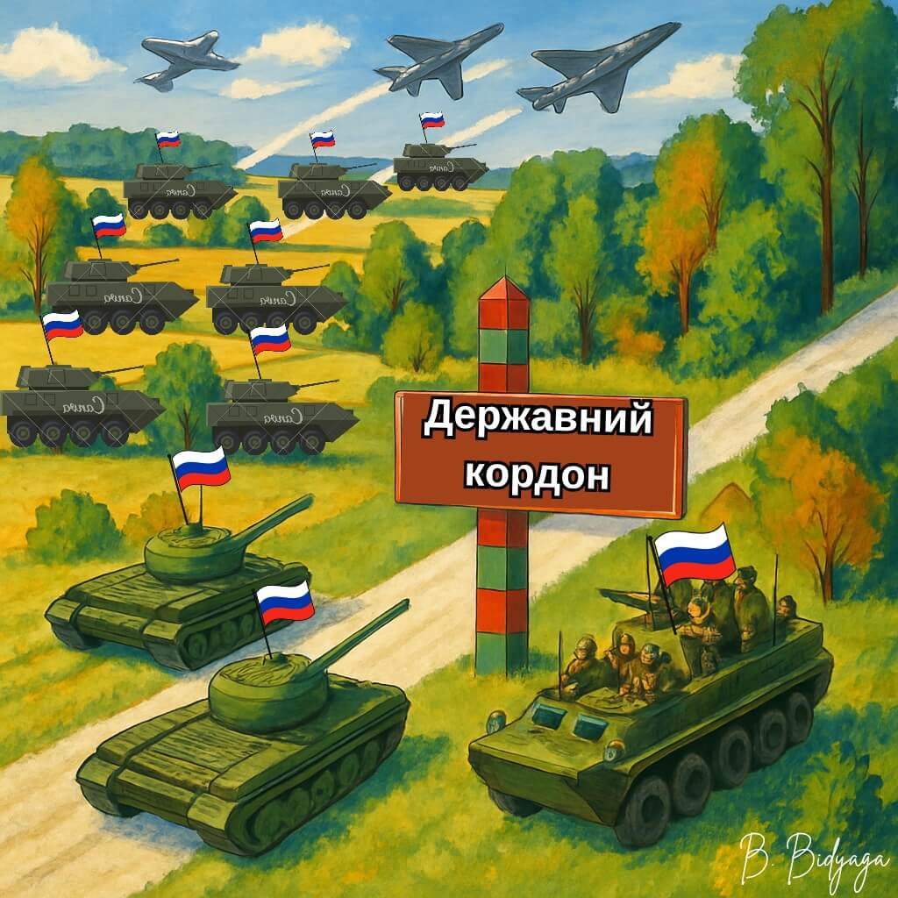

**Путін** (продовжує):  
– Топчуть міжнародне право! Перетинають мої (!) червоні лінії! Терорізують мирне населення! Це ж чистий бандитизм!!! З нацистською символікою…  

**Росія** (люто блиснувши очима):  
– Ах вони безчесники! А куди ж дивиться оця… як її… ООН?  

**Путін** (з абсолютною зневагою, дивлячись на ілюстрацію):
– ООН… [пауза, зневажлива усмішка] Дурнодзвон.

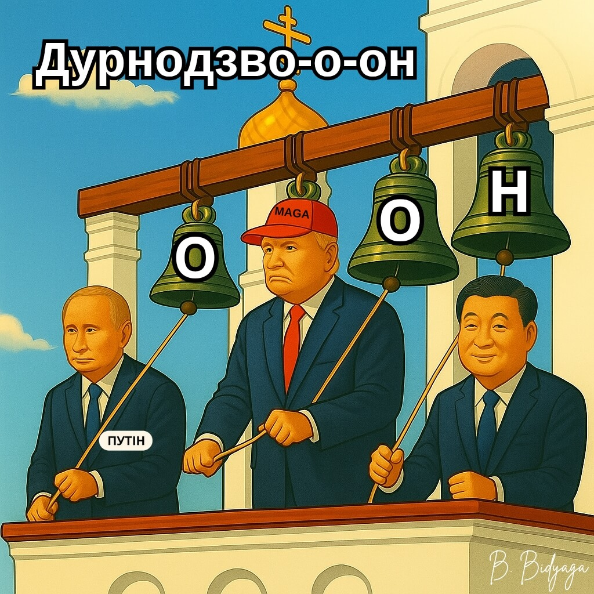

(Пауза)

**Путін** (з перекривленим від злости обличчям):  
– Ще й глушалки у піндо́сів випросили — найновіші, таких навіть у НАТО нема! Розумієш, у чому фішка? Він мене бачить, а я його — ні !!!  

**Росія** (з дурнуватим виглядом):  
– Хто?  

**Путін** (зриваючись на крик):  
– Та пілот! Пілот, що в літаку сидить! У нього така офігенна ріпа, що всі мої радари відпочивають, трясця їх матері!  

> «Ріпа» = РЕБ (засоби радіоелектронної боротьби, через схожість: РЕБ → ребка → ріпка → ріпа).  
«Ріпа» = Традиційний російський овоч.

**Росія** (з обуренням):  
– Ах вони негідники! Нашу традиційну цінність цап-царап! Руки геть від нашої ріпи, басурмани окаянні! Їжте свої маїсові коржі! Щоб вам подавитися!  

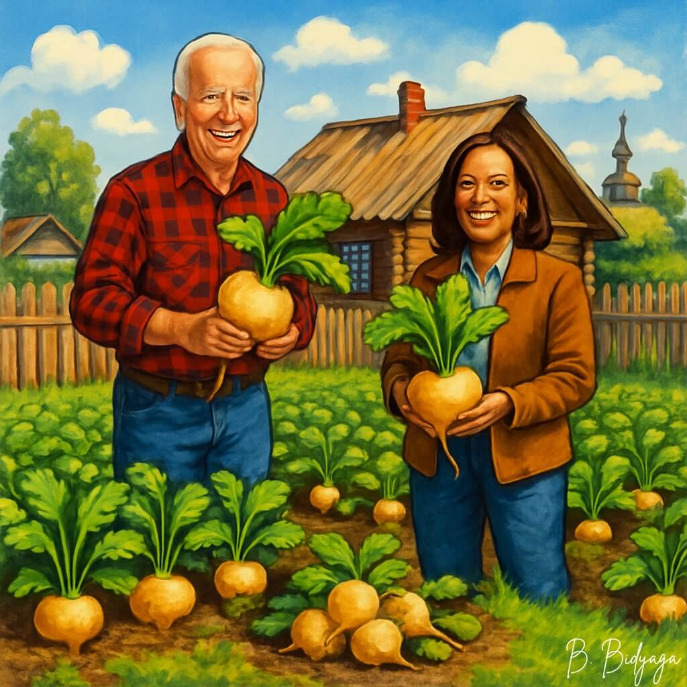

**Путін** (з гіркою посмішкою):  
– Заспокойся! Це інша ріпа.  

**Росія** (з підозрою):  
– Генно-модифікована?  

**Путін** (роздратовано):  
– Та ні! Це радіоглушалки. Глушать мої радари в ноль! І от тобі на — літак-невидимка, твою матір! Не війна, а казка!  

**Росія** (пригнічено):  
– То як воно виходить? Ніби ти з ними у жмурки граєш?  

**Путін** (з гіркою усмішкою):  
– Ото ж бо й воно — отака, матінко, війна в жмурки!  

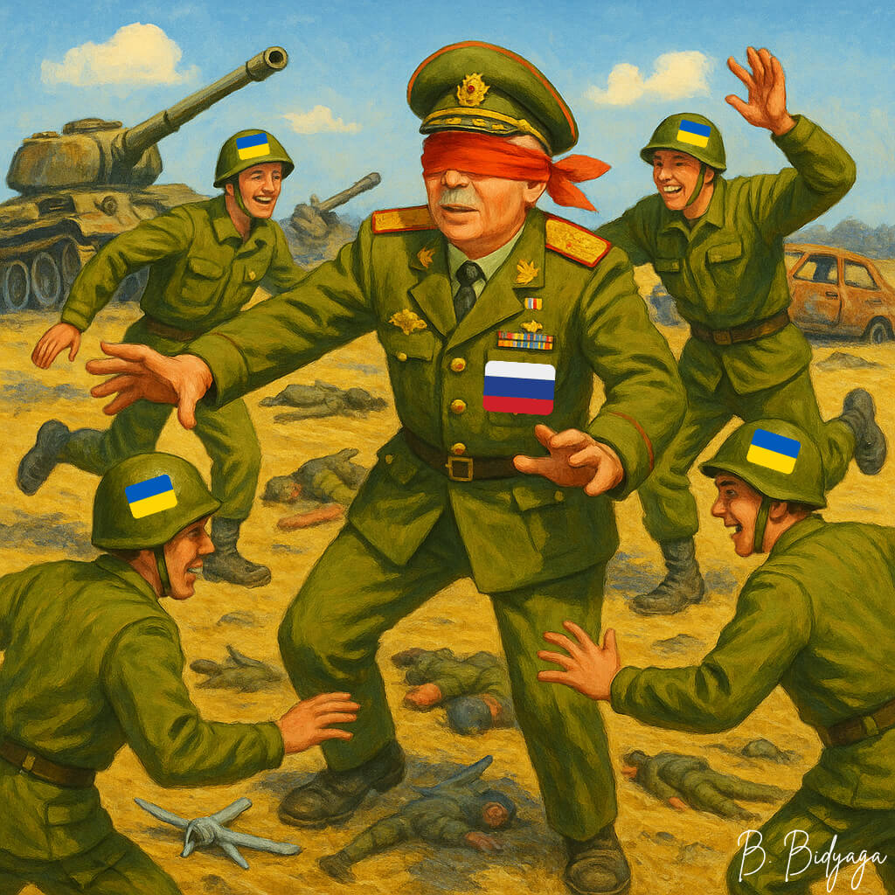

(Мовчання. Путін похмурий, немов гроза. Росія беззвучно шепоче губами.)

**Путін** (раптом прокидаючись, у люті стискаючи кулаки):  
– Трясця їм, піндо́сам! 

**Росія** (співчуваючи):  
– Та ще й які… Ці піндо́си… Звірі, та й годі. Народ русскій з світу зживають. Ось той Обама колись… Усі ліфти нам обссав, сучий син. Ще й на бензин ціни підняв.  

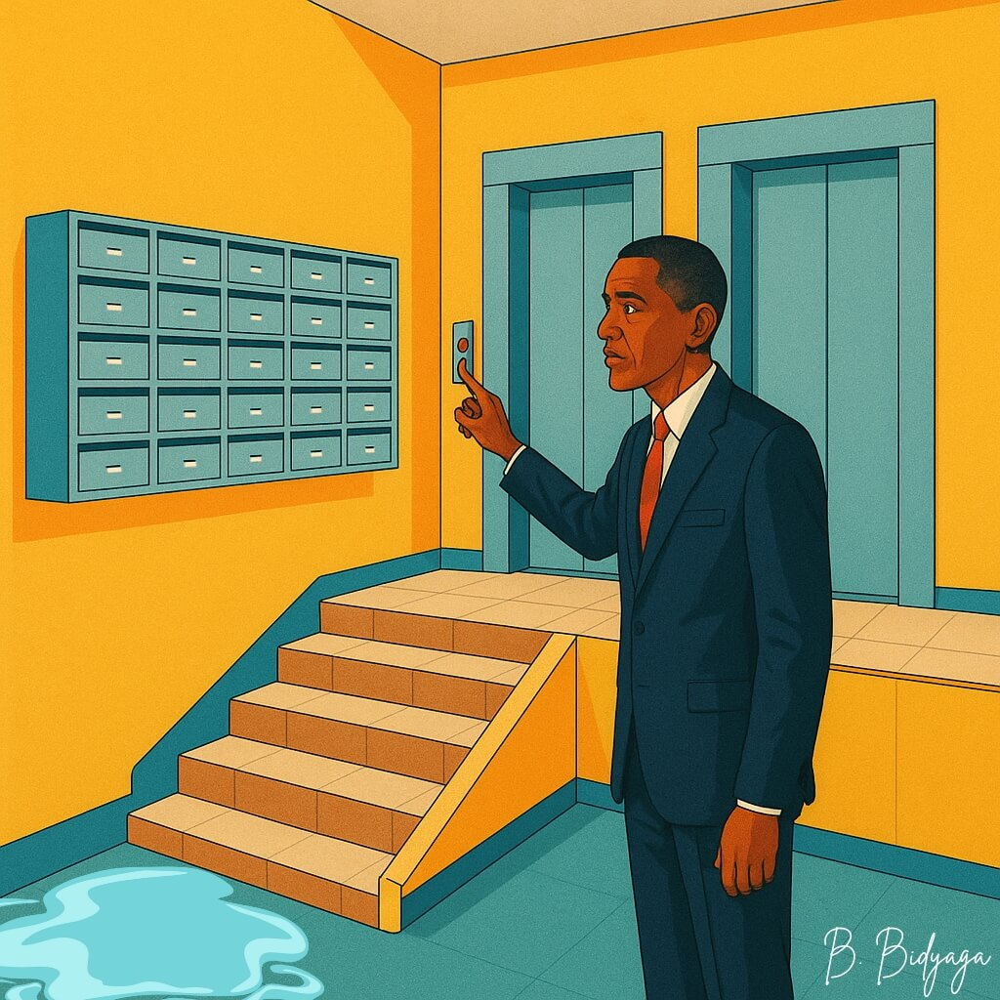

**Путін** (з дратівливою):  
– Який ще Обама? Очухайся, нарешті! Після Обами вже другий президент змінився. Тепер Байден сидить.  

**Росія** (згодливо киваючи):  
– Ну так, ну так. Я ж і кажу. Треба й цьому Байдену в тому… як його… жовтому будинку теж усі ліфти обписати.  

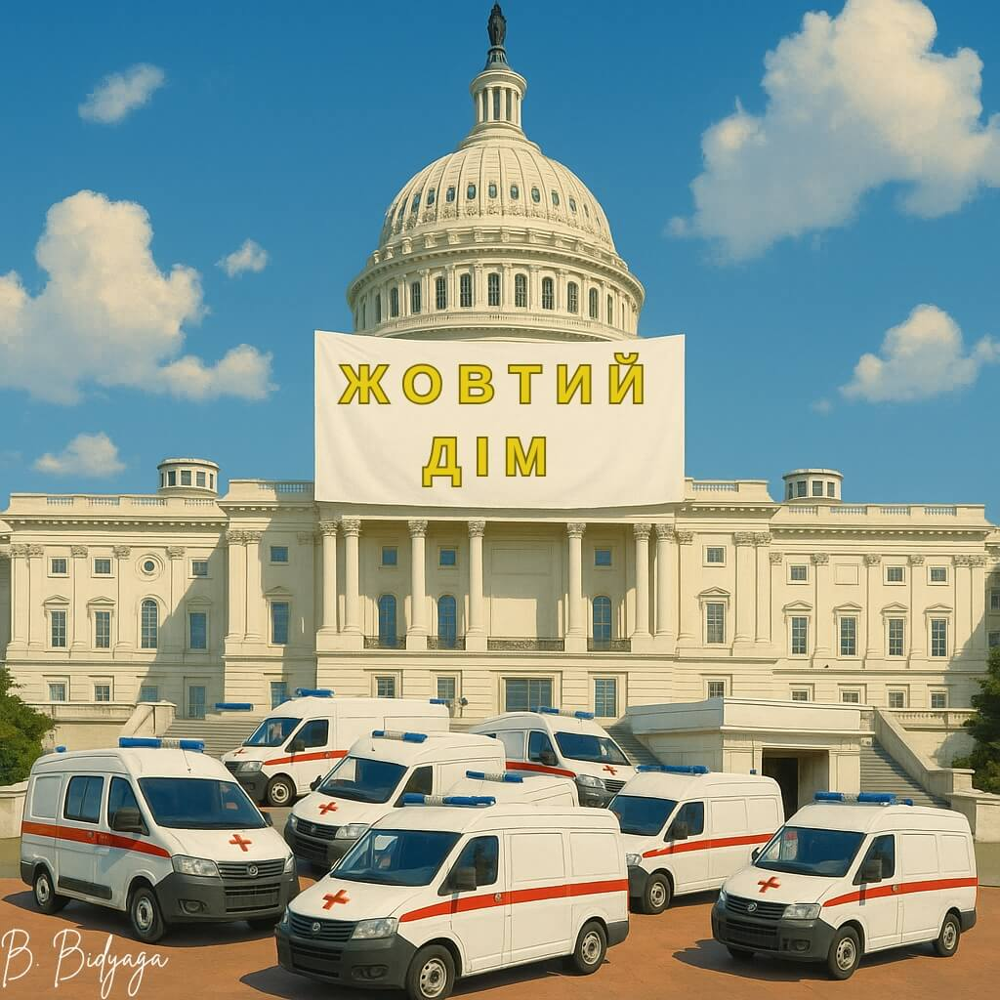

**Путін** (у шаленстві):  
– Та до чого тут ліфти?! 

(Напружена мовчанка. Росія провинувато роззявляє рота, намагаючись щось вимовити, але, не знайшовши слів, безнадійно махає рукою й опускає очі в підлогу.)

**Путін** (після паузи задумливо):  
– Знаєш, що я думаю?  

**Росія** (підлабузницьки):  
– Що?  

**Путін** (нагнітаючи):  
– Думається мені, що тут не обійшлося без інопланетного втручання. 

**Росія** (у жаху):  
– Як?! Прибульці із інших світів?!  

**Путін** (страждальницьким голосом, поступово закипаючи):  
– Ото ж бо й воно! Схоже, на мене нацисти з усієї Сонячної системи повстали! Очолює їх той гидо́тний, холуйський, людиноненависницький блок НАТО! Гомосексуалісти! Підори гнилі! Родителі №1 та №2…
**Іноплагенти!!!**

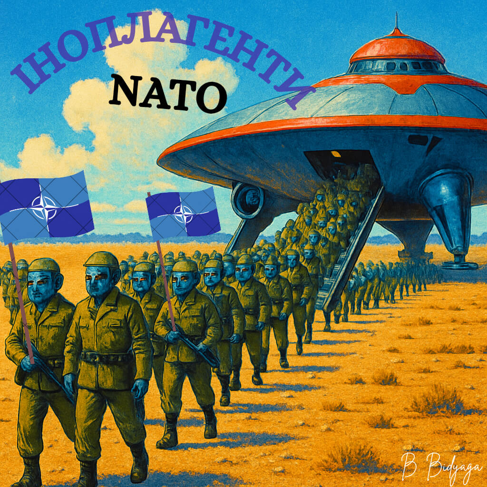

**Путiн** (розлютившись до крайності, раптом вибухає пронизливим вереском):
  – Так я ж цю всю Вселенну до бісової баби підірву!  

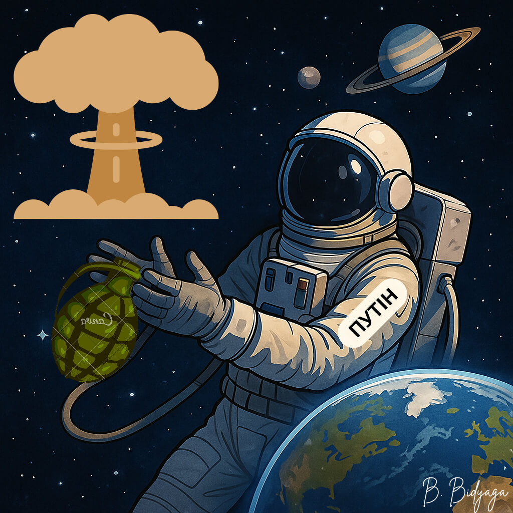

**Росія** (нервово скрикує): 
– Господи, твоя воля!

( I починає конвульсивно шепотіти молитву, дрібно хрестячись і час від часу з гучним стуком б’ючись лобом об підлогу. Путін, випустивши пару, швидко заспокоюється й починає півголосом бурмотіти.)

**Путiн**:
– Ну так, вони ж там усі гендерно-нейтральні. Без первинних статевих ознак… Слава тобі, Господи, ми зовсім не такі!  

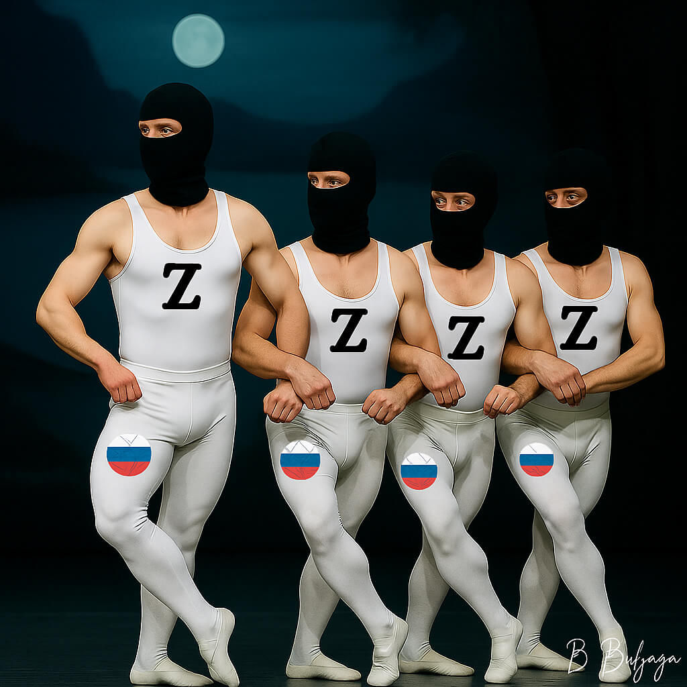

(Путiн перевіряє рукою свої первинні статеві ознаки й задоволено киває. Росія перестає бити поклони й з деякою озиркою вичікувально дивиться на Путіна).  

**Путін** (пригнічено, поступово закипаючи):  
– Скрізь підстава… Навколо зрада… Генерали Батьківщину продають… Усе забезпечення дочиста розкрали. Ладно б у мирний час — крадіть собі на здоров’я. Але ж під час війни?! Зовсім сором загубили. Мої ж танки моїм же ворогам продають! Ось тут, через лінію фронту й переправляють. З рук у руки. У подарунковій упаковці. З бантом на башті. Тьху! Мерзотники!  

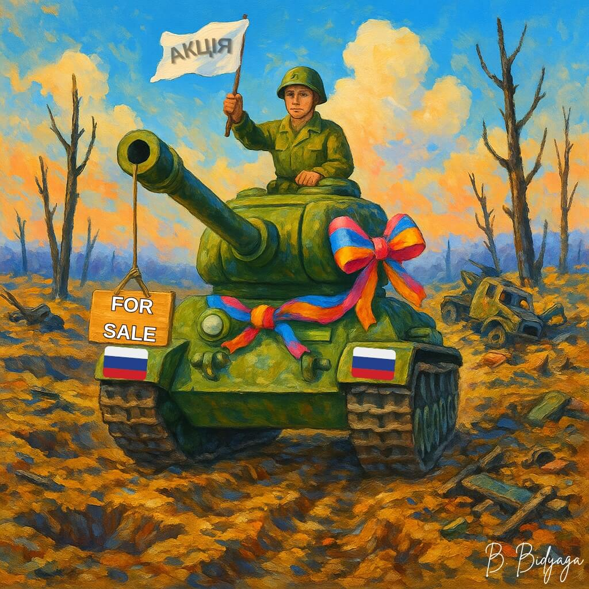

**Росія** (пригнічено хитаючи головою):  
– І мене, значить, грабують, і тебе… Ось, значить, як! Зовсім від рук відбилися…  

**Путін** (безнадійно махнувши рукою):  
– Та-а, що тут казати…  

(Змовкає й на хвилину замислюється. Росія дивиться на Путіна відданим цуценячим поглядом.)

**Путін** (після паузи з кривим усміхом):  
– Гаразд, що ми все про погане та про сумне?  

(Повільно розстібає кітель. Підходить до Росії впритул, хижо посміхаючись.)

**Путiн**:
– Давай краще займемося чимось приємним.  

**Росія** (згодливо киває):  
– Давай, милєночок, давай…  

(Путін обходить Росію ззаду, кладе на її тощі боки свої доглянуті руки — і одразу ж одергує.)

**Путін** ( з неприхованим здивуванням):    
– Та що це ти так висохла, матухо моя? Одна шкіра та кістки?  

**Росія** (знизує плечима):  
– Та я й сама дивуюся…  

**Путін** (з досадою):  
– І потриматися ні за що. Куди поділося все твоє м’ясо?  

**Росія** (безвиразним голосом):  
– А я звідки знаю? Годуюся як завжди, а м’яса на кістках усе менше й менше.  

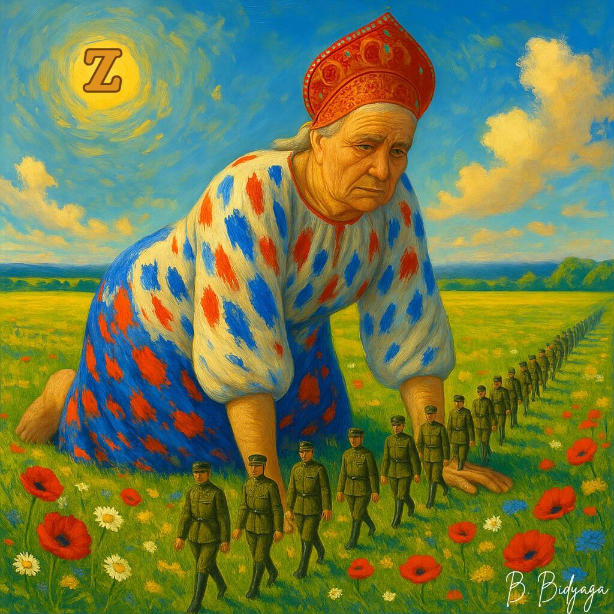

**Путін** (з тривогою):  
– І давно це з тобою?  

**Росія** (намагається згадати):  
– А зараз у нас що? Серпень двадцять четвертого?  

**Путін**:  
– Так. Двадцять четверте серпня.  

**Росія**:  
– Ну, то значить, рівно два з половиною роки тому м’ясо з мене й почало сходити.  

**Путін** (у розгубленості):  
– Але чому?!  

**Росія** (злісно):  
– То ж порчу навели, супостати прокляті, вороги народу русского! Притки та уроки понаставляли.  

> "Наставляти притки", "наставляти уроки" — за стародавніми віруваннями, це різні способи наведення порчі.  

(На хвилину встановлюється мовчанка. Путін у розгубленості чухає потилицю. Шкіра на його чолі збирається у зморшки — видно, що у його голові йдуть напружені роздуми. За хвилину його обличчя розгладжується; він знову кладе руки на худе російське тіло.) 

**Путін** (рішуче):
– Ну, матухо, давай піднімайся.  

**Росія** (уперто, як дитина):  
– Навіщо? Мені й так добре.  

**Путін** (ласкаво гладячи Росію по широкій спині):  
– Рідненька, ну встань з колін, ну будь ласка!  

**Росія** (кокетливо):  
– А я думала, тобі ця поза подобається. Он недавно як стогнав… Ніби жених у першу шлюбну ніч…  

**Путін** (дратівливо):  
– Стогнав не стогнав… Не в тому річ… Просто хочеться чогось нового. Нових завою… Тобто, хотів сказати — нових нафтопрово… От чорт! Нових поз! А тобі хіба не хочеться чогось новенького?  

**Росія** (знизуючи плечима):  
– Новенького? Це яке — добре забуте стареньке? Ну, можна й новенького… Чому б і ні…  

**Путін** (із задоволенням):  
– Ось і чудово! Ось і розумниця! І за що я тебе, дурну стару, люблю?!  

**Росія** (зітхаючи):  
– Багата я… була…  

**Путін** (мрійливо):  
– Так… А тепер я багатий…  

(Оглядає Росію жадібним поглядом.)

 **Путін**:
– Щось ти постаріла, матухо моя, подурнішала…  

**Росія** (образившись):  
– А ти чого хотів? Коли тебе цілий кооператив насилує день і ніч… Ні відпочинку, ні спокою від цих паразитів… 

 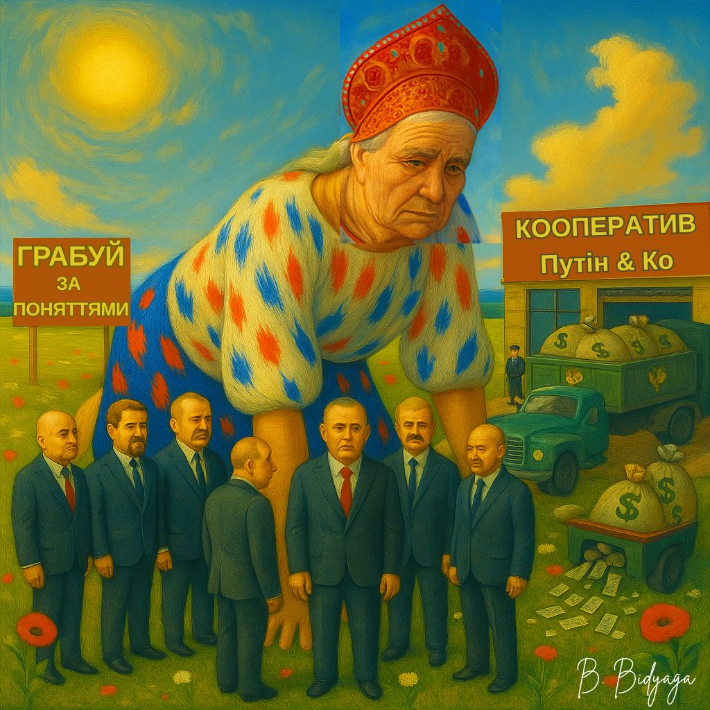

**Путін** (зверхньо):  
– Но-но, дамочка, полегше! Це ж мої друзі. І взагалі: не розумію, чого ти ображаєшся. Гордися повинна. Хіба гріх — хорошій людині дати? А вони всі — чудові хлопці, мамою клянусь.  

**Росія** (бурмоче собі під ніс):  
– Хорошій людині — чому б і не дати? Можна й дати… чого вже там… Та дуже ж жадібні…  

**Путін** (примирливо):  
– Та годі тобі, ти ж отака велика — від тебе не вбуде.  

**Путiн** (після паузи):
– Ну що, спробуємо нову позу?  

(Росія, кряхтя й стогнучи, намагається підвестися з колін, але марно.) 

**Росія**  (жалібно схлипує):
– Так втомилася, що на ногах не стою. Може, до біса цю нову позу? На колінках я вже й звикла.  

**Путін** (суворо):  
– Встань з колін!  

**Росія** (плаксиво):  
– Та навіщо вставати?  

**Путін** (з пафосом):  
– Краще померти стоячи, ніж жити на колінах! 

**Росія** (з жахом схлипуючи):  
– Хрестися, батюшко! Що це ти кажеш? Чого ж нам помирати?  

**Путін** (у бік):  
– Від оргазму, матухо, від оргазму.  

**Росія** (з недовірою):  
– Та хіба ж від цього помирають?  

**Путін** (повчально):  
– Помирають. Якщо оргазм сильний, а організм — слабкий. 

**Росія** (в екстазі):  
– Для мене померти в твоїх обіймах — велика честь! Коханий…  

**Путін** (байдуже):  
– Ну так, ну так…  

(Пауза.) 

**Путiн** (з пожадливістю): 
– Розкажи, як ти мене любиш.  

**Росія** (ніжно):  
– Люблю, мій миленький, ой як люблю! На цілих сімдесят вісім і дев’ять десятих відсотка. Та ти  заспитай у Центрi Опитувань — люди вчені, не дадуть збрехати.  

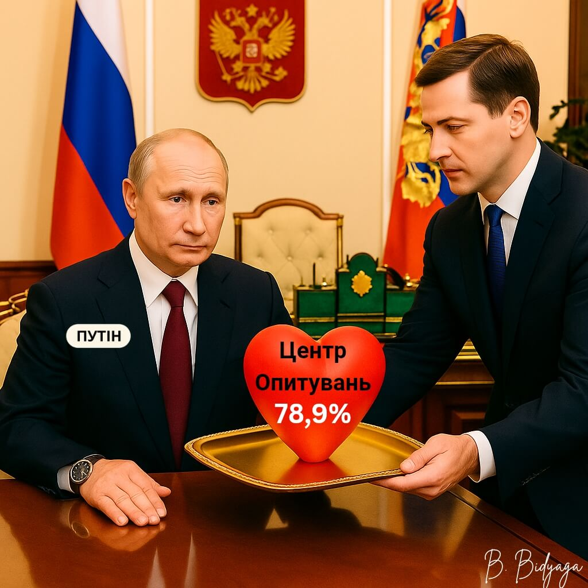

**Путін** (з насмішкою, трохи встромляючи шпору в російську мляву дупу):  
– Ну… Скільки відсотків тепер?

**Росія** (від захвату й пристрасті):  
– О-о-о! Як же мені з тобою добре! Ще, милєночок, ще!  

**Путін** (встромляючи шпору до упору):  
– А так? Добре?  

**Росія** (у повному екстазі):  
– Ой, не можу… Ой, не можу… Ой, не можу… Кінчаю… Кінчаю… Кінчаюсь… Давай разом, а?  

**Путін** (з посмішкою):  
– Мені кінчатися ні до чого — я ще в самому розквіті сил. У мене все життя попереду!  

**Росія** (ледь ворочаючи язиком):  
– Та ж Володін от що казав? «Нема Путіна — нема Росії»? 

> Вячеслав Володiн — спикер Держдуми Pосii

**Путін** (холодно):  
– Навпаки, на щастя, не так. Росії нема, а Путін є! 

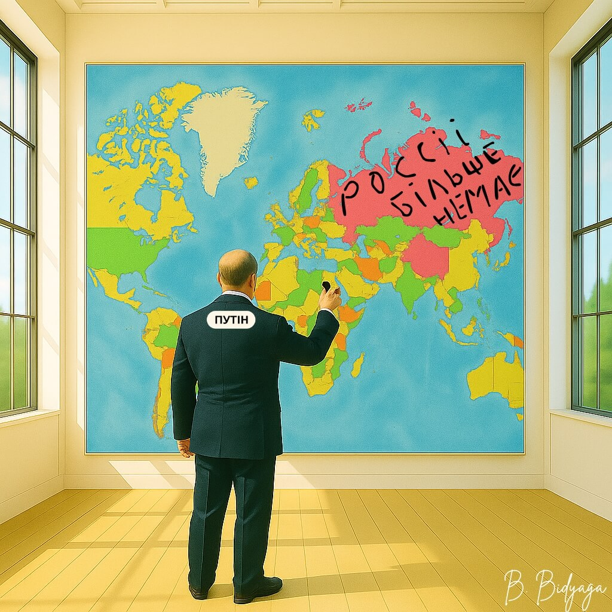

(З огидою дивиться на Росію, що б’ється у передсмертних судорогах, повертається й йде.)

*24.09.2024*
*Туреччина – Грузiя*

**ISBN 978-5-9903439-2-4**
**© Щеглова О.В., 2024**  

